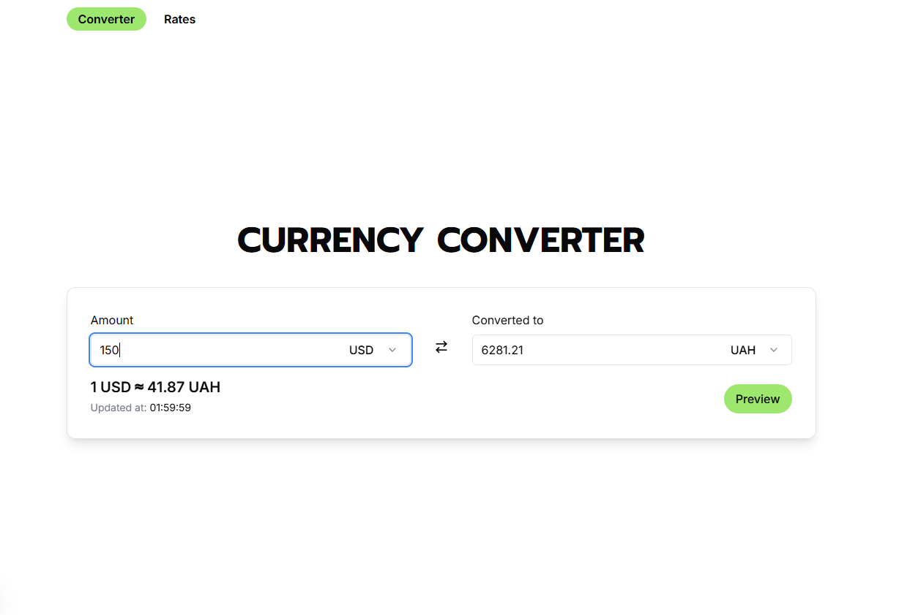
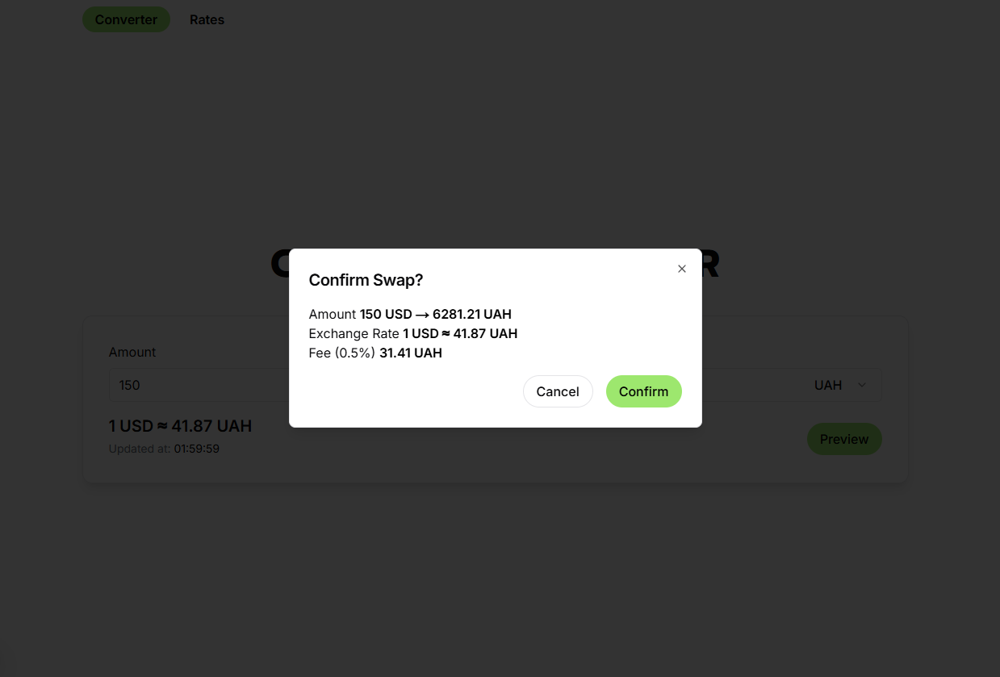
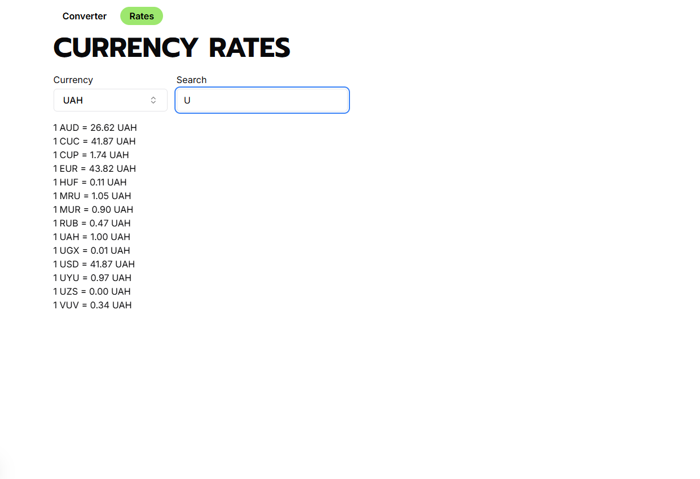

## Currency Converter

A simple application for converting currencies in real time. It fetches exchange rates from a reliable API and allows users to convert between different currencies easily

## Technologies Overview

**Frontend**
- NextJS
- TypeScript
- TanStack Query
- Tailwind CSS
- Shadcn

**Other**
- [currencyapi](https://currencyapi.com/)
- Vercel

## Getting Started

First, run the development server:

```bash
npm run dev
```

Open [http://localhost:3000](http://localhost:3000) with your browser to see the result.

## Examples



